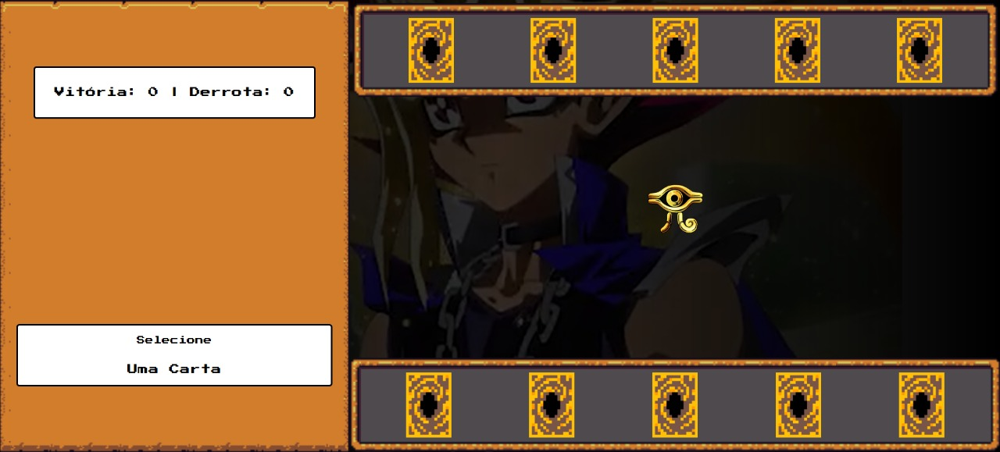

# 🃏 YU-GI-OH Jo-ken-po Edition

Um jogo de **Pedra, Papel e Tesoura (Jokenpô)** com temática de **YU-GI-OH**, feito como projeto final de curso de **Frontend**.

Este jogo apresenta cartas animadas, trilha sonora, efeitos visuais e interações inspiradas no universo do anime, com personagens como **Blue Eyes White Dragon**, **Dark Magician** e **Exodia**.

---

## 🎮 Como jogar

1. Ao abrir a página, clique uma vez para ativar a música de fundo.
2. Você verá 5 cartas viradas na parte inferior.
3. Passe o mouse sobre cada carta para visualizar os detalhes.
4. Clique em uma carta para enfrentar o adversário.
5. Veja o resultado do duelo (Win / Lose / Draw) e clique no botão para o próximo duelo.

---

## 📁 Estrutura de pastas

```
projeto/
│
├── index.html                   # Página principal
├── src/
│   ├── assets/
│   │   ├── audios/              # Músicas e efeitos sonoros
│   │   │   └── egyptian_duel.mp3, duelResults.wav
│   │   ├── cursor/              # Cursores personalizados
│   │   ├── icons/               # Imagens das cartas e ícones
│   │   └── video/               # Vídeo de fundo looping
│   ├── scripts/
│   │   └── engine.js            # Lógica principal do jogo
│   └── styles/
│       ├── main.css             # Estilização geral
│       ├── buttons.css          # Estilização dos botões estilo RPG
│       └── containers_and_frames.css # Layout dos frames personalizados
```

---

## 🚀 Como rodar o projeto

1. Clone ou baixe o projeto.
2. Abra o arquivo `index.html` em qualquer navegador moderno (Chrome, Edge, Firefox).
3. Ao clicar na tela, a música de fundo será ativada.
4. Aproveite!

---

## 💡 Tecnologias utilizadas

- HTML5
- CSS3 (modularizado)
- JavaScript (ES6+)
- Fontes retrô com Google Fonts
- Cursor e som personalizados
- Temática e design inspirado em YU-GI-OH

---

## ⚠️ Observações

- A reprodução automática de áudio é bloqueada por navegadores — por isso, o som só toca após o primeiro clique do usuário.
- Certifique-se de que todos os arquivos estão dentro das pastas corretas (`/src/assets`, `/scripts`, `/styles`).

---

## 📷 Imagem do jogo



---

## 👨‍💻 Autor

Projeto desenvolvido por Guilherme Moura como parte do curso de **Desenvolvimento Front-End** da plataforma **Digital Innovation One**.

---

## 📜 Licença

Este projeto é apenas para fins educacionais. YU-GI-OH é uma marca registrada de seus respectivos criadores.
